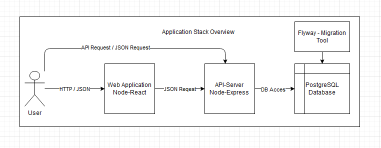
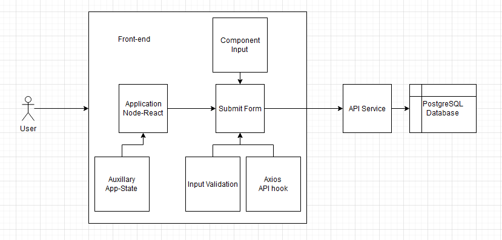
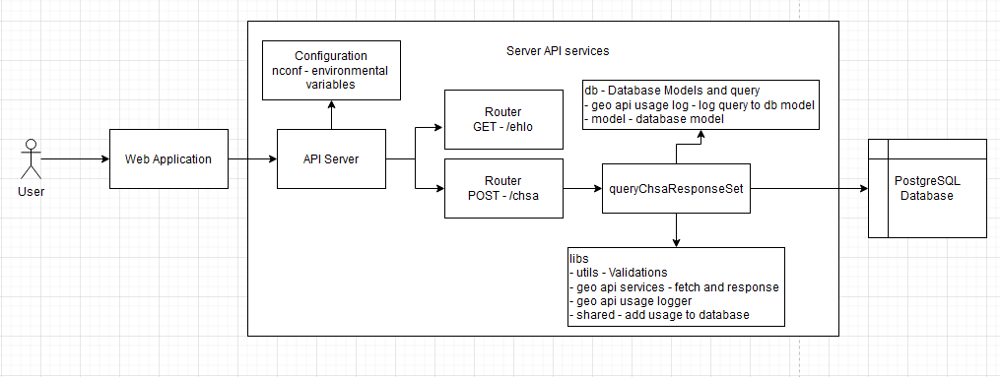
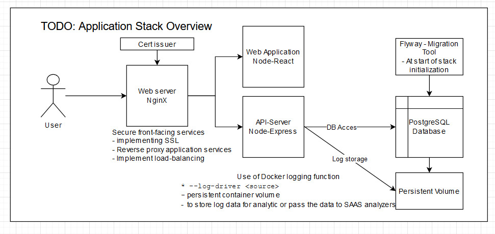

# chsa
A simple, proof-of-concept web app

## Pre-requisites
- Docker
- node
- npm
- ansible

### Instructions for building and deploying locally

# Step 1
If you have ansible installed on your machine, run this single-line CLI command
```
ansible-playbook playbooks/setup.yaml
```
Otherwise, manually create a `.env` file according to [the sample env file](./.env.sample) and run
```
mkdir pg_data &&\
    cd api && npm ci && npm run build &&\
    cd ../web && npm ci && npm run build
```

# Step 2
Run `docker-compose up` at project root path.

# Step 3

Visit http://localhost:8101 via a web browser.

If you wish to skip web ui and directly interact with api,\
the service is at http://localhost:8100 and REST endpoint description can be found in [open api doc](api/public/doc/api/index.html)\
(need to open the html in a browser).

---

### Instructions on how to query db to find out # requests

See [DB README](db/README.md)

---

## Application overview 


## Web Frontend overview


## API services overview



### TODO

Due to a quick turnaround, these items are yet to be mature:

- unit tests coverage for both api and web component
- <s>There is a severity vulnerability issue reported from `npm audit` - the issue is yet to be resolved.</s>
- <s>modify Docker persistent volume strategy</s>
- <s>create a Technical architecture diagram</s>

### Future Roadmap

TODO
- Implementing Web server NginX on front facing clients
- Use of SSL and HTTPS to secure front facing client
- Use of reverse proxy between client, server and database from private IP
- Implment Loadbalcing, cache



